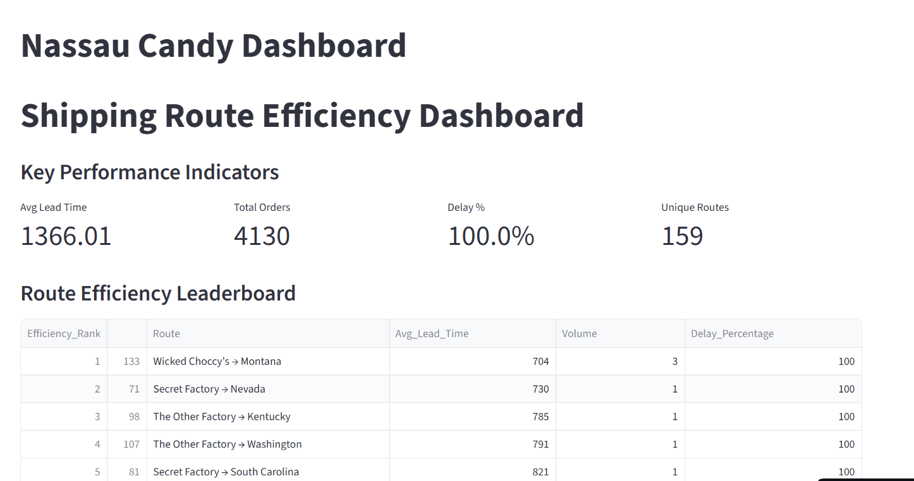
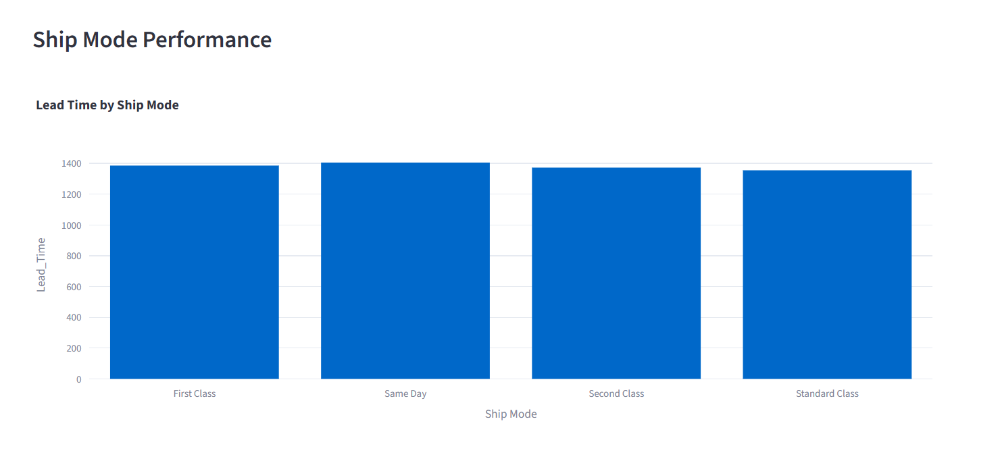
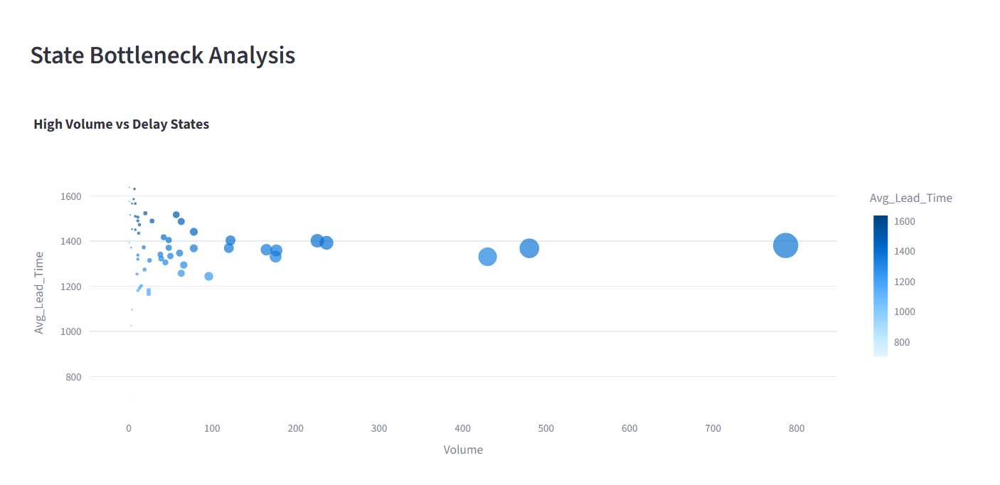

factory to customer shipping route efficiency analysis for nassau candy distributor

Nassau Candy Shipping Efficiency Dashboard

A Streamlit-based analytics dashboard for evaluating shipping performance, delivery efficiency, lead times, and logistics bottlenecks across factory-to-customer routes for Nassau Candy distributors.

 Project Overview

The Nassau Candy Shipping Efficiency Dashboard is a data analytics application built using Python, Streamlit, Pandas, and Plotly.
The project helps analyze and visualize shipping operations by tracking:

Average delivery lead time
Delayed shipments
Route efficiency
Ship mode performance
State-wise bottlenecks
Monthly shipping trends

This dashboard enables logistics teams and business managers to identify inefficient shipping routes and optimize distribution strategies.

 Features
 Interactive KPI Dashboard
 Route Efficiency Leaderboard
 Ship Mode Performance Analysis
 State Bottleneck Detection
 Monthly Shipping Trend Visualization

    Dynamic Filters for:
Region
Ship Mode
Date Range
 Raw Dataset Viewer

 Technologies Used
Python
Streamlit
Pandas
NumPy
Plotly Express
 Dataset Information

The dataset contains shipping and order information including:

Order Date
Ship Date
Product Name
Region
Ship Mode
State/Province
Order ID

The system preprocesses the dataset to calculate:

Lead Time
Delay Percentage
Route Efficiency
Factory Mapping
  Installation & Setup
1️⃣ Clone the Repository
git clone https://github.com/your-username/nassau-candy-dashboard.git
cd Nassau-candy-dashboard
2️⃣ Install Dependencies
pip install -r requirements.txt
3️⃣ Run the Streamlit App
streamlit run app.py
  Dashboard Modules
 KPI Metrics

Displays:

Average Lead Time
Total Orders
Delay Percentage
Unique Shipping Routes
 Route Efficiency Leaderboard

Ranks routes based on average shipping lead time.

 Ship Mode Analysis

Compares performance of different shipping modes.

 Bottleneck Detection

Identifies states with high shipping delays and order volumes.

 Trend Analysis

Visualizes monthly average lead time trends.

Dashboard Preview

 🔹 dashboard.png

🔹 optimizations output

 🔹 charts

 🔹 map view

🔹raw dataset.png

  Business Benefits
Improves logistics visibility
Detects delivery bottlenecks
Enhances operational efficiency
Supports data-driven shipping decisions
Reduces shipment delays
 Project Structure
├── app.py
├── Nassau Candy Distributor.csv
├── requirements.txt
└── README.md
 GitHub Profile
Developer Information

Kalyan Kumar

GitHub: https://github.com/kalyankumar09-m/factory-to-customer-shipping-route-efficiency-analysis-for-nassau-candy-distributor.git 
🌐 Live App: [click here to view app] https://fgrlkwt7k6z3upup2kmgtc.streamlit.app/

  Future Enhancements
Predictive delay analytics using Machine Learning
Real-time shipment tracking
Geographic route mapping
Export reports to PDF/Excel
Warehouse performance analysis
