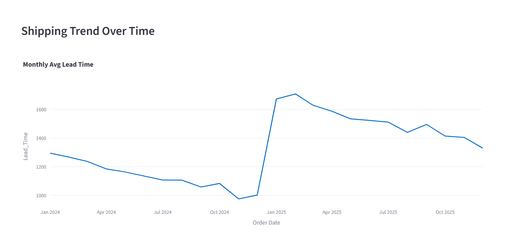
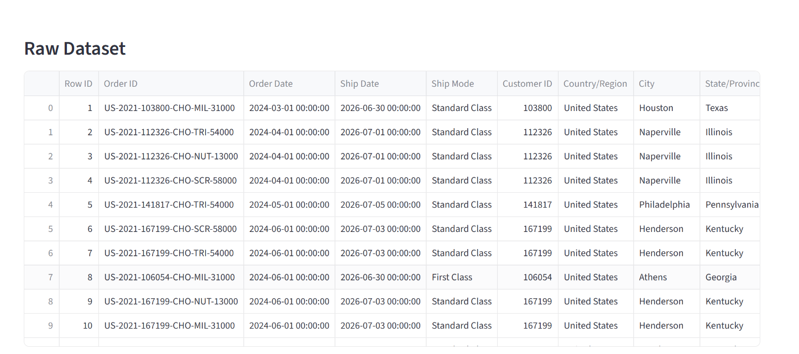

# 🍬 Nassau Candy Shipping Efficiency Dashboard

A Streamlit-based analytics dashboard for evaluating shipping performance, delivery efficiency, lead times, and logistics bottlenecks across factory-to-customer shipping routes for Nassau Candy distributors.

---

# 📌 Project Overview

The **Nassau Candy Shipping Efficiency Dashboard** is a logistics analytics application developed using **Python, Streamlit, Pandas, NumPy, and Plotly**.

The dashboard helps analyze and visualize shipping operations by monitoring:

- Average delivery lead time
- Delayed shipments
- Route efficiency
- Ship mode performance
- State-wise bottlenecks
- Monthly shipping trends

This project enables logistics teams and business managers to identify inefficient shipping routes and optimize distribution performance.

---

# 🚀 Features

✅ Interactive KPI Dashboard  
✅ Route Efficiency Leaderboard  
✅ Ship Mode Performance Analysis  
✅ State Bottleneck Detection  
✅ Monthly Shipping Trend Visualization  
✅ Dynamic Filters  
✅ Raw Dataset Viewer  

---

# 🎛️ Dashboard Filters

Users can filter data based on:

- Region
- Ship Mode
- Start Date
- End Date

---

# 🛠️ Technologies Used

| Technology | Purpose |
|---|---|
| Python | Core Programming |
| Streamlit | Dashboard Development |
| Pandas | Data Processing |
| NumPy | Numerical Operations |
| Plotly Express | Interactive Visualizations |

---

# 📂 Dataset Information

The dataset contains shipping and order details such as:

- Order Date
- Ship Date
- Product Name
- Region
- Ship Mode
- State/Province
- Order ID

The preprocessing pipeline calculates:

- Lead Time
- Delay Percentage
- Route Efficiency
- Factory Mapping

---

# ⚙️ Installation & Setup

## 1️⃣ Clone the Repository

```bash
git clone https://github.com/kalyankumar09-m/factory-to-customer-shipping-route-efficiency-analysis-for-nassau-candy-distributor.git
```

## 2️⃣ Navigate to Project Folder

```bash
cd factory-to-customer-shipping-route-efficiency-analysis-for-nassau-candy-distributor
```

## 3️⃣ Install Dependencies

```bash
pip install -r requirements.txt
```

## 4️⃣ Run the Streamlit App

```bash
streamlit run app.py
```

---

# 📦 Requirements

Create a `requirements.txt` file with:

```txt
streamlit
pandas
numpy
plotly
```

---

# 📊 Dashboard Modules

## 🔹 KPI Metrics

Displays:

- Average Lead Time
- Total Orders
- Delay Percentage
- Unique Shipping Routes

---

## 🔹 Route Efficiency Leaderboard

Ranks shipping routes based on average lead time.

---

## 🔹 Ship Mode Analysis

Compares delivery performance across shipping modes.

---

## 🔹 Bottleneck Detection

Identifies states with:

- High shipping delays
- High shipment volumes

---

## 🔹 Trend Analysis

Visualizes monthly shipping performance trends.

---

# 📈 Business Benefits

- Improves logistics visibility
- Detects shipping bottlenecks
- Enhances operational efficiency
- Supports data-driven decisions
- Reduces shipment delays

---

# 🖼️ Dashboard Screenshots

## 🔹 Main Dashboard


---

## 🔹 Optimizations Output



---

## 🔹 Charts & Visualizations


---

## 🔹 Map View



---

# 📁 Project Structure

```bash
├── app.py
├── Nassau Candy Distributor.csv
├── requirements.txt
├── README.md
├── dashboard.png
├── optimizations_output.png
├── charts.png
└── map_view.png
```

---

# 🌐 Live Demo

🚀 Streamlit App:

https://fgrlkwt7k6z3upup2kmgtc.streamlit.app/

---

# 👨‍💻 Developer

## Kalyan Kumar

### GitHub Repository

https://github.com/kalyankumar09-m/factory-to-customer-shipping-route-efficiency-analysis-for-nassau-candy-distributor

---

# 🔮 Future Enhancements

- Predictive delay analytics using Machine Learning
- Real-time shipment tracking
- Geographic route optimization
- Export reports to PDF/Excel
- Warehouse performance analytics

---

# 📜 License

This project is developed for educational and analytical purposes.

---

# ⭐ Support

If you found this project useful, give it a ⭐ on GitHub!
